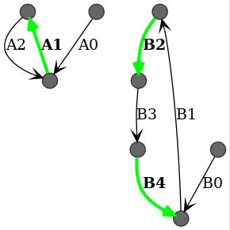
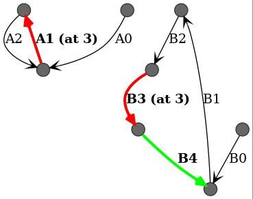
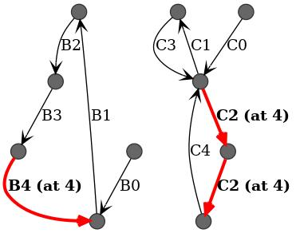
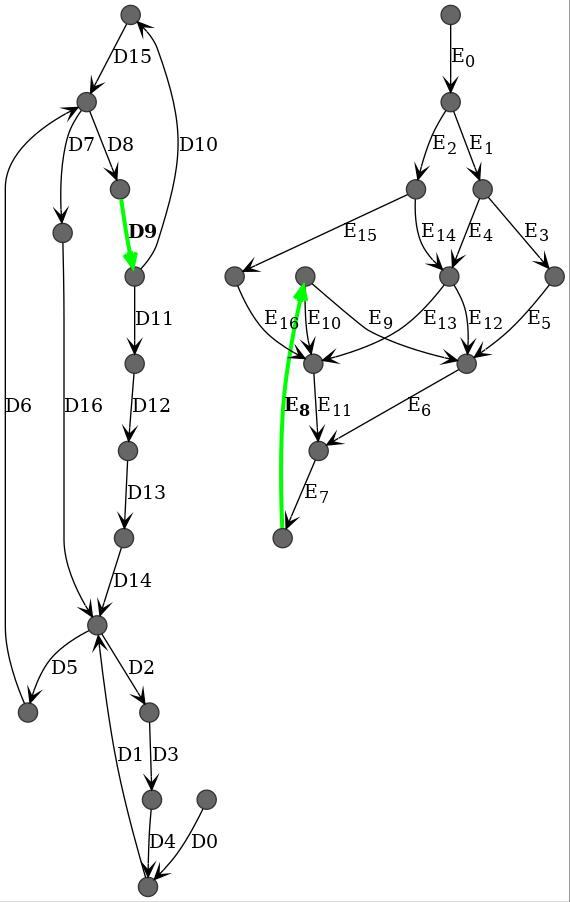
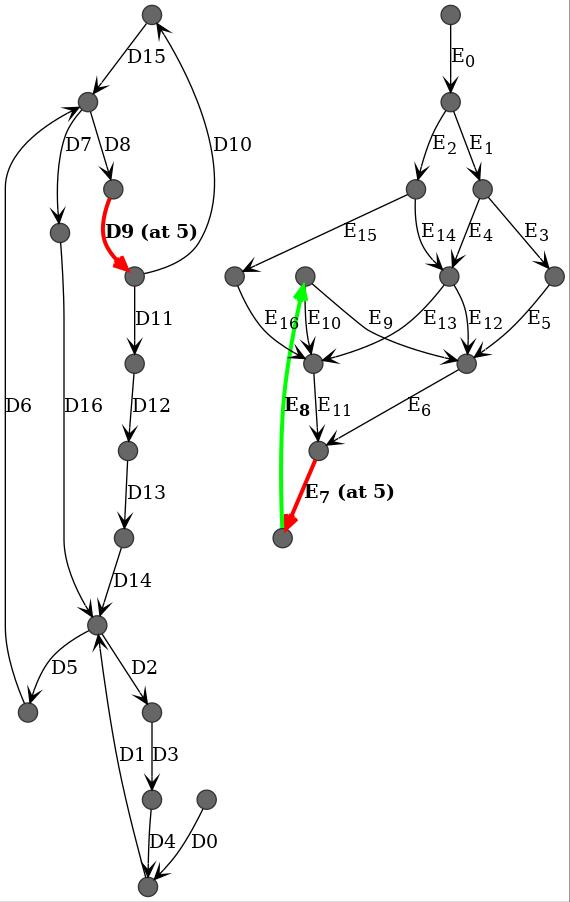

# Examples

This directory contains two kinds of JSON files:
- description of tasks; and
- description of exclusion groups.

The `img/` directory lists some scenarios that are described in the
`scripts/test.sh` file. They are shown below. Each figure shows the different
tasks that compose the application. Red temporal transitions are the ones that
were in the same exclusion group but overlap (the first overlap date is
specified).  Green temporal transitions are the ones that do not overlap with
others.  If all temporal transitions are green, it means there are no overlap,
and the exclusion group holds.

## A-B-no-overlap

## A-B-with-overlap

## B-C-with-overlap

## B-C-with-overlap2

## C-D-with-overlap

## D-E-no-overlap

## D-E-with-overlap

## A-F-no-overlap

